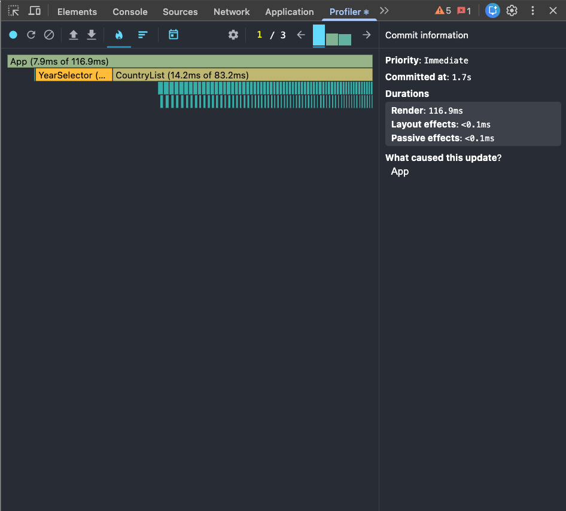
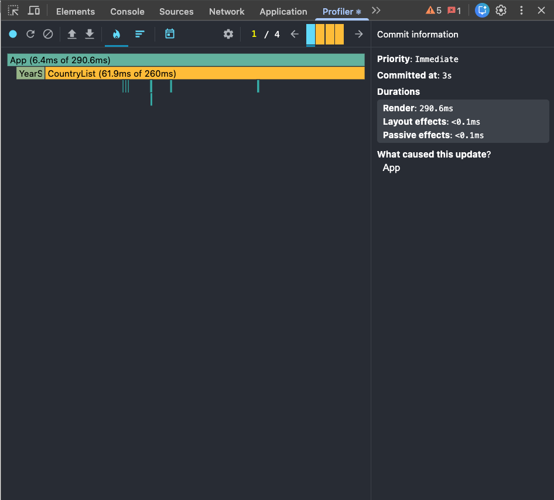
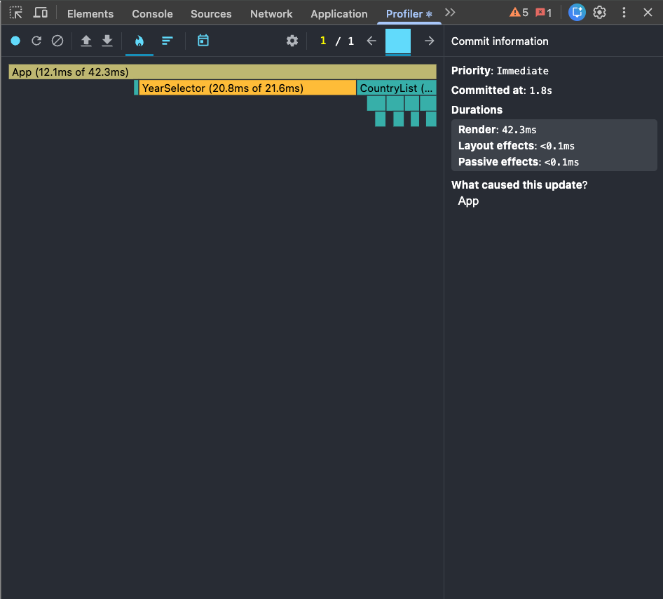
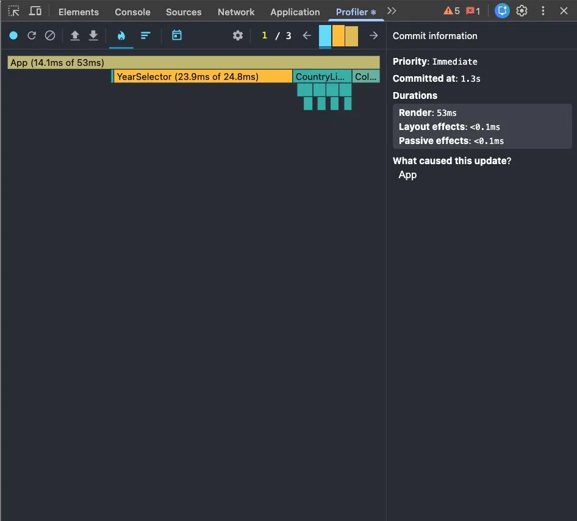
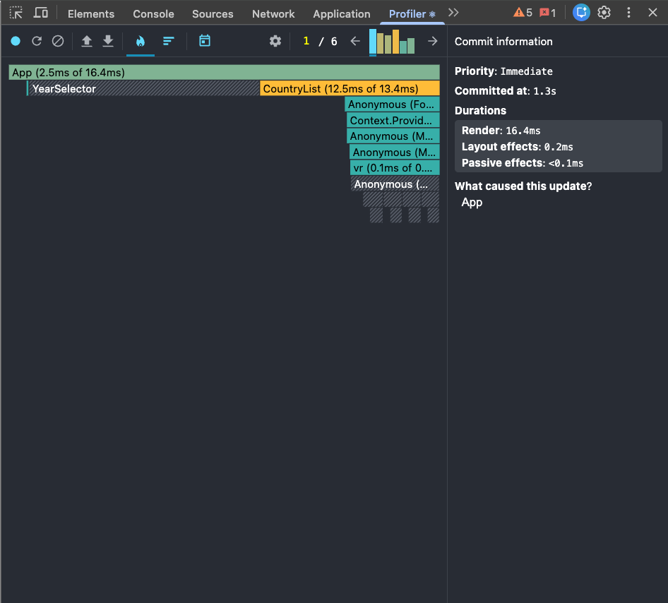
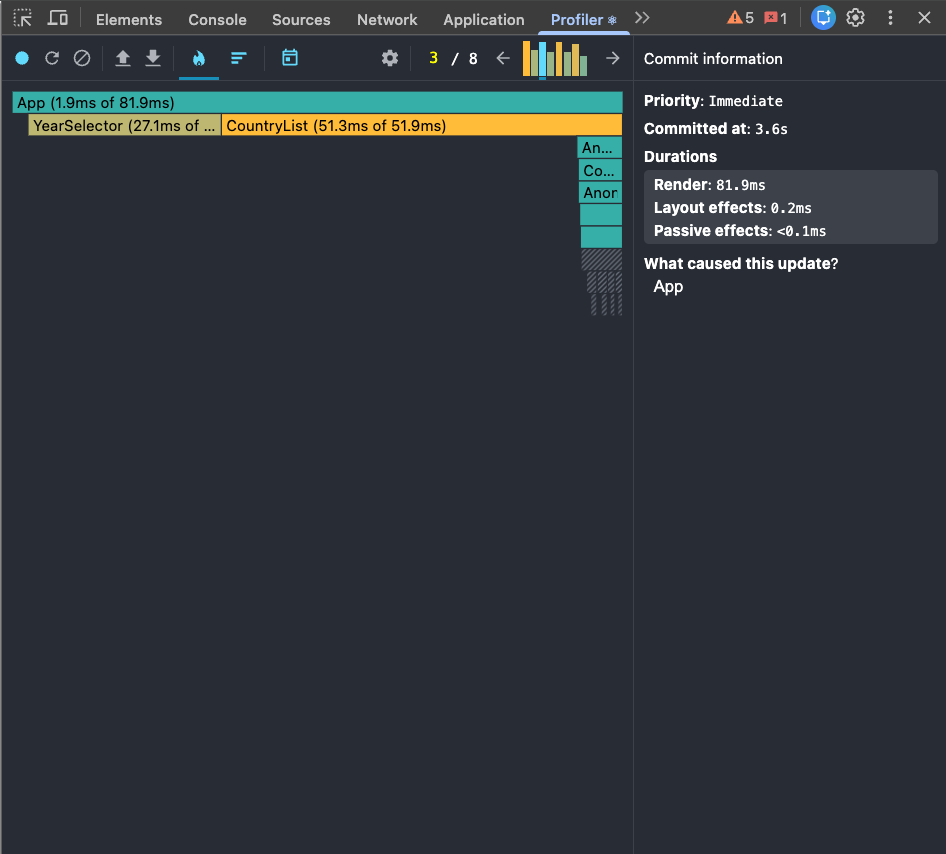
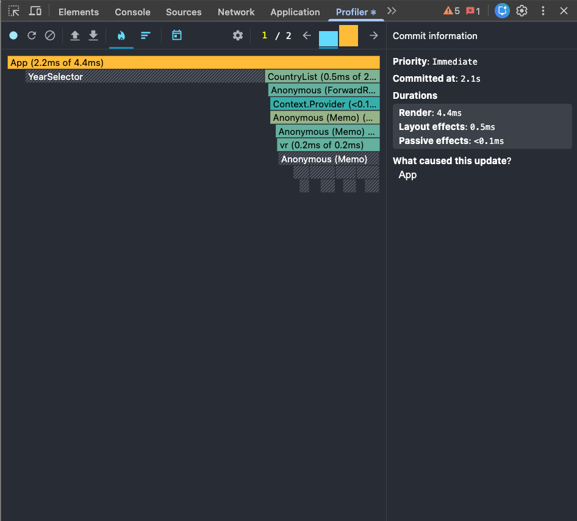
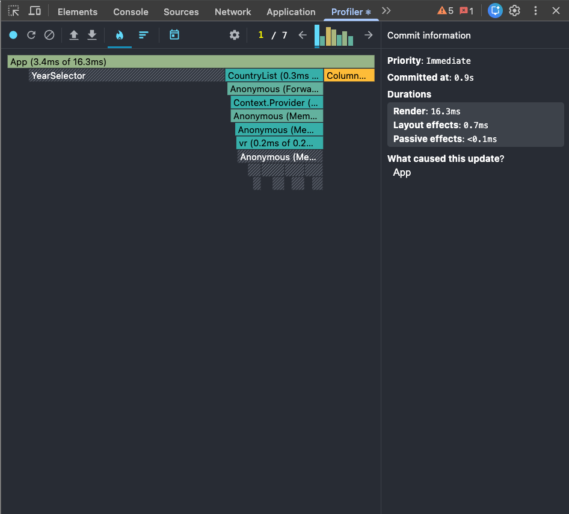

# Performance Report

## Baseline (Before Optimization)

| Interaction | Render Duration | Notes |
|---|---|---|
| Search | 116.9ms | CountryList 83.2ms, all cards re-rendered |
| Year change | ~285ms | CountryList ~255ms, all cards re-rendered on every change |
| Sorting | 42.3ms | YearSelector 21.6ms + full list re-sorted and re-rendered |
| Toggle columns | 53ms | YearSelector 24.8ms re-rendered unnecessarily |

### Search

### Year Change

### Sorting

### Toggle Columns

### Observations
- Every interaction caused full re-render of all CountryCard components
- `filteredCountries` was recalculated on every render
- `createYearDataMap` was called for every country on every sort
- All DOM nodes for all countries were mounted at once (no virtualization)
- `key={index}` caused unnecessary reconciliation

---

## Optimizations Applied

### 1. `useCallback` for all event handlers in `App`
Prevents handler recreation on every render, allows memoized child components to skip re-renders.

### 2. `useMemo` for `years` and `availableColumns` in `App`
Avoids recomputing static data on every render.

### 3. `useMemo` for `filteredCountries` in `CountryList`
Filter + sort recalculates only when dependencies change.

### 4. `React.memo` on `CountryCard`, `DataTable`, `SearchBar`, `YearSelector`, `ColumnModal`
Components skip re-render when their props haven't changed.

### 5. `useMemo` for `yearDataMap` in `CountryCard`
Map is not recreated on every render.

### 6. Fixed `key` props
`key={index}` → `key={country.id}` and `key={column}` for correct reconciliation.

### 7. Virtualization with `react-virtuoso`
Only visible country cards are mounted in the DOM instead of all ~300.

---

## Final Results (After Optimization)

| Interaction | Baseline | Optimized | Improvement |
|---|---|---|---|
| Search | 116.9ms | 16.4ms | **-86%** |
| Year change | ~285ms | ~82ms | **-71%** |
| Sorting | 42.3ms | 4.4ms | **-90%** |
| Toggle columns | 53ms | 16.3ms | **-69%** |

### Search

### Year Change

### Sorting

### Toggle Columns

### Observations
- `YearSelector` is now striped (grey) in flame chart = skipped re-render in most cases
- `CountryList` renders only visible items via virtualization — only ~10 cards in DOM instead of ~300
- `CountryCard` components are memoized and skip re-renders when props unchanged
- Year change improved by 71% due to virtualization rendering only visible cards
- Sorting improved by 90% due to `useMemo` on `filteredCountries`
